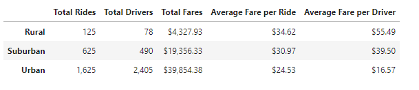

# PyBer_Analysis
An analysis of ride sharing data for the company PyBer.

## Overview of the Analysis
Our client is PyBer, a ride-sharing company. They wish for us to conduct two different analyses for this project. The specific analysis they are interested in is:
 - A summary of the data by City Type
 - A multiple-line chart of the total fares for each city type

For the analysis we were provided with the following files of data in csv format:
 - city_data.csv
 - ride_data.csv

Additionally we were provided with some starter code (PyBer_Challenge_starter_code.ipnyb) prior to starting the analysis.

The analysis was conducted using the following products:
 - Python
 - Pandas
 - Matplotlib

In addition to this written analysis we delivered a summary table, a multiple-line chart and our code in a Jupyter Notebook.

## Results

The results of the fare analysis by City Type are shown in the table below.

There are a few things that stand out in this table, as expected, there are fewer riders and drivers in Rural Cities than in Suburban or Urban Cities. However the Average Fare per Ride and Average Fare per Driver are higher in Rural Cities than in Suburban or Urban Cities.  

In addition to the analysis by City Type we conducted an analysis of Total Fare by City Type for a four month period in the beginning of 2019. The chart below shows the analysis on a weekly basis for the first four months of the year.

When reviewing the mulitple-line chart there are a couple of things that jump out:
 - Generally there are some similarities between the City types - for example, from a lower total fare at the beginning of January, all show a peak just before March
 - There is a lot of variability in March for Urban Cities that is not seen in the other two City Types
 - While the Urban and Rural Cities show a slight decrease at the end of April there is a relatively dramatic increase in Suburban Cities for that same time period

The multiple-line chart is quite useful in showing the similarities and discrepancies in total fare for the different City Types.

## Summary

As a result of running the analysis there are a few items we would recommend to the CEO of PyBer.

1. The Average Fare per Ride and Average Fare per Driver are higher for Rural Cities then for Suburban and Urban Cities. While we may assume that this is because the ride duration in Rural Cities is longer, adding ride duration information to the data table and doing an additional analysis would help us define a possible reason for the difference. 
2. The multiple-line chart shows us that for all three City Types the first week in January is lower then many other weeks at the beginning of the year. There may be a marketing opportunity we can provide to the CEO to promote the ride-sharing service for the holiday season. 
3. The Suburban Cities show a dramatic increase towards the end of April while the Urban and Rurual Cities show a slight decrease in Total Fare. An additional analysis as to why this is happening in Suburban Cities but not in other City Types could help the CEO determine if there are things she can do to generate an increase in total fares at the same time in the Urban and Rural Cities.

The data analysis shows us some trends and some additional analysis may help the CEO determine some marketing or business opportunites that will help expand the PyBer business. 

